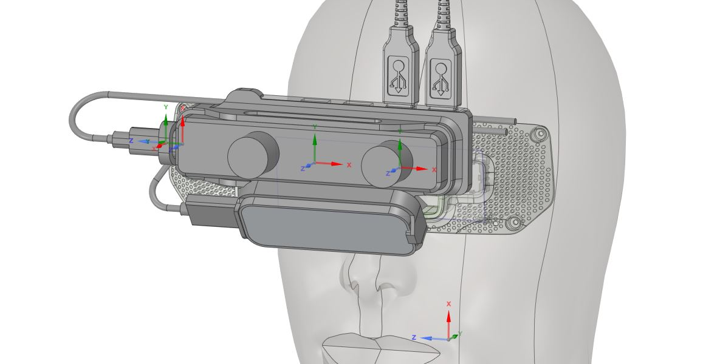
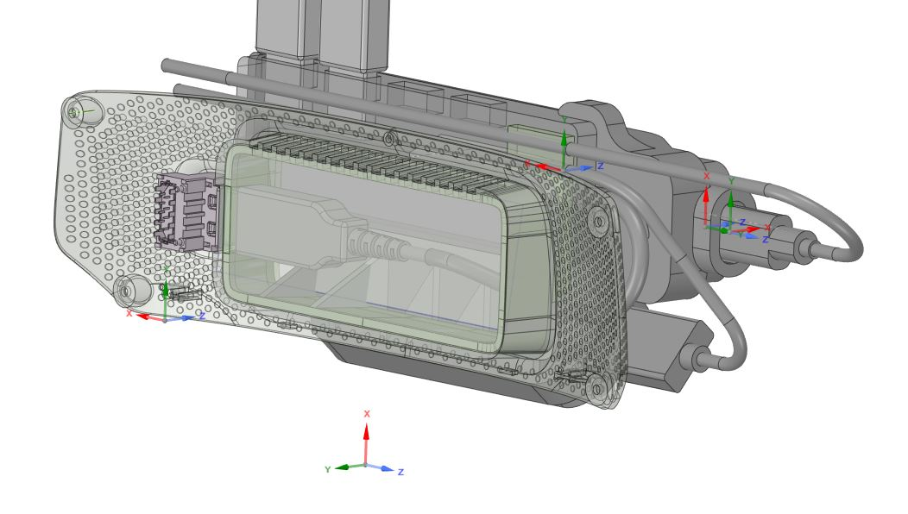
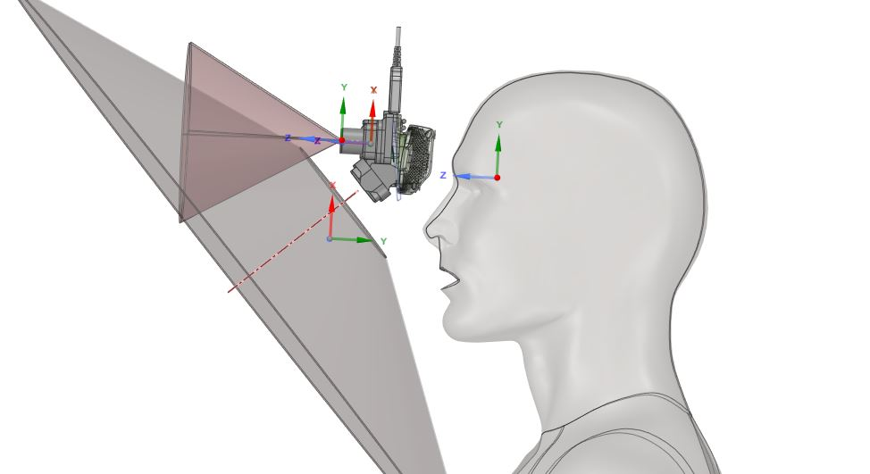

# index-frunk-4-leap-motion-and-more
Repo for design assets for (work in progess; incomplete) valve index frunk adapter for the leapmotion, stereolabs zed-mini and a usb hub.

 

Design files stored in DesignSpark Mechanical, a free-to-use CAD system based on Spaceclaim.
if you don't use it yet; head over to [RS Components](https://www.rs-online.com/designspark/mechanical-download-and-installation) to download it!

Also included in the [Export Folder](export) is a single STEP file for import into other CAD tools.

[license detail](https://creativecommons.org/licenses/by-nc-sa/4.0/legalcode)
